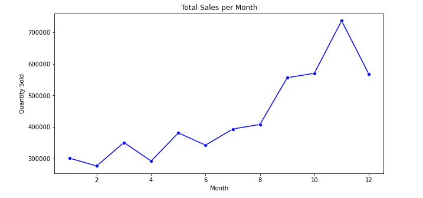
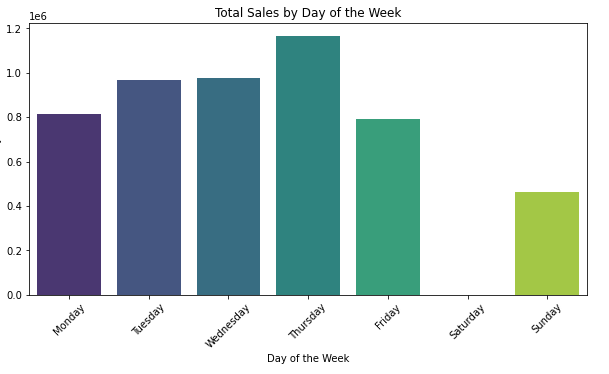

# Online Retail Data Analysis

## 📌 Project Overview
This project explores an **online retail dataset** to analyze sales trends, customer behavior, and product performance. Through **exploratory data analysis (EDA)** and visualization techniques, we aim to extract actionable insights that can help optimize business strategies and enhance customer satisfaction.

## 📂 Dataset Information
- **Source:** Online Retail Transactions
- **Columns:**
  - `InvoiceNo` - Unique transaction ID
  - `StockCode` - Product identifier
  - `Description` - Product name
  - `Quantity` - Number of items sold
  - `InvoiceDate` - Date and time of purchase
  - `UnitPrice` - Price per unit of the product
  - `CustomerID` - Unique identifier for customers
  - `Country` - Country of purchase

## 🛠️ Data Cleaning Steps
- **Handled missing values:**
  - Removed rows with missing `CustomerID` (135,080 missing values)
  - Dropped `Description` where missing (1,454 missing values)
- **Removed duplicates** to avoid redundant analysis.
- **Converted `InvoiceDate` to datetime format** for time-based analysis.

## 📊 Key Analysis & Findings
### 1️⃣ Sales Trends Over Time
- **Peak sales month:** **November** (likely due to Black Friday & holiday shopping)
- **Lowest sales month:** Early months of the year
- **Highest sales days:** Midweek (Tuesdays & Wednesdays)
- **Lower sales on weekends**

### 2️⃣ Top-Selling Products
- The top-selling products were **gift-related items**, likely indicating bulk purchases for corporate or festive gifting.
- **Product demand follows seasonal patterns** (e.g., higher demand during holiday seasons).

### 3️⃣ Customer Behavior
- A small percentage of **high-value customers contribute to most sales** (Pareto Principle).
- Certain customer groups frequently return items, indicating potential product quality issues or order errors.

### 4️⃣ Country-Wise Analysis
- **UK dominates sales**, but international customers also contribute significantly.
- Other top-selling countries include **Germany, France, and the Netherlands**.

## 📈 Visualizations
1. **Monthly Sales Trends** 
2. **Sales by Day of the Week** 
3. **Top-Selling Products** 

## 💡 Recommendations
✅ Optimize inventory for peak seasons (e.g., November sales surge).
✅ Focus marketing efforts on **high-value customers**.
✅ Investigate high return rates & improve customer satisfaction.
✅ Expand international sales strategies to strong markets.

## 🛠️ Technologies Used
- **Python (Pandas, NumPy, Matplotlib, Seaborn)**
- **Jupyter Notebook**
- **Git & GitHub** for version control

## 📌 Next Steps
🚀 Implement a predictive model to forecast future sales trends.
📊 Develop an interactive dashboard for real-time data visualization.
📦 Optimize stock levels based on seasonal demand predictions.

---
**📬 Contact:** _For any questions, feel free to reach out!_
